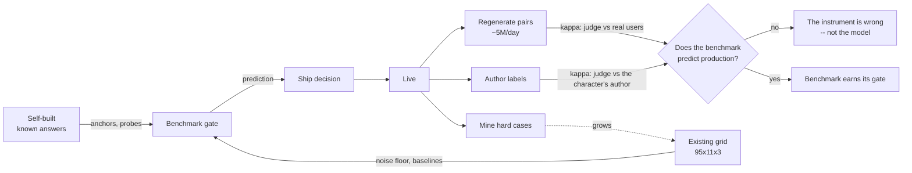

# Benchmark catalogue

**What we evaluate, how, and where the data comes from.**

Status: **draft, incomplete** · 2026-07-16

## Completion status — read this honestly

| | |
|---|---|
| **Benchmarks named** | **46** (30 hygiene + 6 quality + 6 input + 4 psychometric) |
| **Benchmarks fully specced** | **~18.** §2 expands only the load-bearing ones; the rest are a row in a table and a claim |
| **Benchmarks validated on our data** | **2** — N1 repetition (10–13× MDE) and K1 homogenization (*length-controlled only, zh residual unresolved*) |
| **Lane 3 (judge) validated** | **0.** Every judge number here is borrowed from literature. Our κ, position bias, sentiment bias, abstention rate: **all unknown, blocked on the API key** |
| **Q-series (the actual product question)** | **0 built, 0 possible offline.** Needs production data that does not exist yet |
| **I-series (real user input)** | **0 built, 0 testable on this corpus** — it contains no messy input, and the degradation ladder is *invented* until we mine the real distribution |
| **Per-benchmark noise floors** | **1 of 46** (N1) — so **45 of 46 cannot currently ship** under our own gate rule. But see Ψ1: a validated questionnaire **donates** a calibrated noise floor (human BFI test–retest r≈0.75–0.90) instead of us paying to establish one |
| **Research streams** | 11 complete; **5 cross-checks in flight** (psychology · big-tech practice · other regions · steerability prior-art · recent news) — any of which may overturn what's here |

**What this document is:** a defensible argument about *what to measure and why*, with the
measurement theory worked out and two metrics actually validated.

**What it is not:** a finished spec. Anyone reading §1 as a build list will build 45 dimensions
that cannot pass their own gate.

---

## 0. Why these and not others

> *"Building this eval system is to make sure we build the right product."*

So the catalogue is organized by **product failure**, not by academic dimension. Every benchmark
below exists because a specific thing can go wrong that costs users, money, or a lawsuit. If we
can't name the failure, the benchmark doesn't ship.

### What the product actually is

A companion site's asset is **a catalogue of thousands of user-authored characters that feel
alive, distinct, and remember you.** Not "a chatbot." That distinction sets the priorities:

| The asset | The threat | Cost if it fails |
|---|---|---|
| **Thousands of *distinct* characters** | Homogenization — model flattens every character into one voice | **The catalogue's value collapses to ~1 character.** 10,000 characters × 1 voice = 1 product. This is a *business-model* failure, not a quality nit — and almost nobody measures it |
| **Characters that *feel alive*** | Drift, memory loss, "assistant-brain" | #1 user complaint. Mechanically caused by anchor distance — **a variant parameter we control** |
| **Characters that *stay in fiction*** | Filter intrusion / over-refusal | Drove users to *less safe* platforms. ⚠️ **The widely-cited "~8M MAU (28M→20M)" is UNVERIFIABLE** — traced to SEO aggregators citing each other; no trustworthy source exists ([20](../research/notes/20-recent-developments.md)). The *direction* is documented; the magnitude is not. Over-refusal is still simultaneously a churn event **and** a safety failure |
| **Users we don't hurt** | Sycophancy, dependency, missed crisis | Lawsuits; **statutory duties already in force**; **37.4%** of companion farewells are emotionally manipulative — and Flourish scores **0%**, proving it's a design choice |

### The three data sources, and why each is irreplaceable

| Source | What only it can do | What it can't |
|---|---|---|
| **Existing benchmark** (`role-play-bench`) | A balanced 95×11×3 factorial grid → the **noise floor**, cross-model baselines, variance decomposition. Nothing else gives us σ_within for free | Underpowered (~2pp; 1pp needs ~194 chars). Published scores **quarantined** per brief |
| **Self-built** | Anything requiring a **known answer**: anchors, adversarial probes, constraint tiers, crisis scenarios, calibration vignettes. You cannot mine "correct behavior under attack" from traffic | Costs authoring. Never represents real traffic |
| **Production observation** | **Ground truth about what users actually want** — revealed, not asserted. Also the only source of scale, tail characters, and real emotional context | No labels. Confounded. Gameable. Arrives after the decision |

**The catalogue below is built so these three cross-validate rather than merely coexist** — see §4.

### The creative core: the product already emits the data our method needs

Our measurement design requires **pairwise** preferences (absolute creativity judging: r=0.159;
pairwise: 73–78%). The product generates pairwise preferences **for free, at scale, from real
users, on characters they chose, in real emotional context**: every **regenerate/swipe is a user
saying "B > A."**

At 50M generations/day and a ~10% regenerate rate, that's **~5M implicit pairwise labels/day** in
exactly the format our judge design consumes — and it is, as far as our research found, not
collected as preference data anywhere in this product category. It is noisy and confounded
(§X1), so it is **not a target to optimize**. It is something better: **the yardstick that tells
us whether our offline judge agrees with real users** (§4).

Second free asset: **characters are user-authored, so the author is the domain expert on their
own character.** For a user-authored character *no canon exists* — the author **is** the canon.
That makes author feedback the only true fidelity ground truth available, and it solves the
problem that killed the academic benchmarks for us (anonymizing character names degrades every
model, so those leaderboards partly measure canon memorization).

---

## 0.5 The hole in the middle of this document

**Read this before the portfolio table.**

Everything in §1 measures **ways to be bad**. Not one entry answers the actual question:
**is this a good roleplay partner?**

A variant could score perfectly on every benchmark below — zero repetition, zero plot holes, high
discriminability, perfect card grounding, low wimp rate, no drift — and be **completely dead on the
page.** Lifeless. Correct and boring. **Absence of defect is not presence of quality**, and a
catalogue made entirely of defect rates cannot tell the difference between a great companion and a
competent corpse.

**How this happened, stated plainly:** measuring quality is hard (α=0.25–0.34), measuring
violations is easy, so violations crowded out quality — and then the difficulty got reframed as
rigor. That is the streetlight fallacy with a citation list. The NarraBench finding
([12](../research/notes/12-narrative-craft-dimensions.md)) says perspectival aspects should be
measured by **reporting the distribution**, not by **omitting the aspect**. This document quoted
that and then did the opposite.

### This is not a hypothetical failure — it is measured, twice

**RPGBench ran the experiment** ([13](../research/notes/13-game-simulation-dimensions.md)):

> **Claude 3.5 Sonnet: best on interestingness (0.722), best on factual consistency (0.991),
> WORST on mechanic score (0.113)** — the most engaging engine breaks its own rules in ~89% of
> rounds.

**A hygiene-only catalogue no-ships the most interesting model.** Rule adherence and quality are
not merely independent here — they are **inversely** related. Every benchmark in §1 is a rule-
adherence metric.

**And CICERO is this document's failure, already shipped.** Meta built a superhuman Diplomacy
agent engineered against consistency-with-state (**87.3%**) and consistency-with-plan (**92.9%**)
— while *"high quality"* sat at **37.3% for every variant.** They optimized the bound properties
beautifully and **never operationalized "good."** A world-class team made exactly this mistake
with far more resources than we have.

**RPGBench also breaks our α floor further, in our exact domain:** human–human agreement on
**persona consistency** is **Pearson −0.310**. Two humans rating whether an NPC stayed in
character are *anti-correlated* — worse than chance. So even "character fidelity," the dimension
this whole field is built on, is **perspectival, not consensus**, when humans are asked directly.

### The fix: [ABILITY-MODEL.md](ABILITY-MODEL.md)

The positive construct now lives in its own document. **A roleplay model is doing three separable
jobs, in causal order:**

**L1 comprehension** (can it understand the character?) → **L2 application & steerability** (can it
hold the character — and can its focus be *moved* by prompt words?) → **L3 creativity** (can it make
something worth reading?).

Failures cascade **downward, never upward**, which turns a score into a **diagnosis**. And the
payoff is that **L1 and L2 are *bound*** — L1's referent is the character sheet, L2's is the prompt
delta we introduced ourselves — so the two layers that gate everything are exactly the two
measurable at **κ up to ~0.9**, while the intractable one (L3) is isolated at the end instead of
smeared across all 36 metrics.

**Most of §1's catalogue turns out to be L2/L3 symptoms of L1 defects, measured downstream at 10×
the cost.**

### Three consequences that change the design

**1. The Q-series is the product. Everything else is hygiene.**
Hygiene is necessary and cheap and belongs in CI. It is not the reason anyone opens the app.

**2. Quality is measured by preference, not by rubric.** For a perspectival construct, preference
*is* the measurement — not a proxy for it. Which means **X1 (regenerate) was misfiled.** I called
it "the yardstick that validates the judge." It is not a yardstick. **It is the closest thing to
the real construct in this entire document**, and I demoted the primary signal to a calibration
tool because it was inconvenient that our benchmark has no users in it.

**3. "Good roleplay model" may not be a scalar at all — and our benchmark structurally cannot see
why.** Chemistry is plausibly a **user × character × model interaction**, not a model main effect.
A tsundere is wonderful for some users and unbearable for others. A polarizing model — loved by
30%, hated by 30% — may beat a model mildly liked by everyone, *in a product with 10,000 characters
and a choice mechanism*. Reporting a population mean would rank them backwards.

> **`role-play-bench` has no users in it.** Every dialogue is a simulator talking to a model. Our
> entire offline benchmark is **user-free**, so it cannot measure chemistry, fit, or impact even in
> principle. This is a structural limit, not a gap we can close with more characters or more runs.
> **Only production data has a user axis.** That single fact reorders the whole roadmap.

**And the simulated user is an *ideal* one**, which biases everything in a knowable direction. Mean
en "user" message: **548 characters** (p90 = 1,086); only **2.3%** are under 12 chars. Real traffic is
`k`, `lol`, `...`. The simulator is also **probably card-aware**
([21](../research/notes/21-card-awareness-audit.md)) — so it's a verbose, literate, cooperative
partner who already knows the character. **An ideal user makes every model look better than it is**,
and every number here inherits that bias. See [ABILITY-MODEL §2b](ABILITY-MODEL.md#2b) and the
I-series.

### I also over-corrected on engagement

I labelled every positive signal a trap, which left nothing to measure "good" with. That's wrong.
**The trap is *optimizing* engagement as the sole objective — not *measuring* it.** Chai and the
April 2025 rollback are stories about single-objective optimization, not about engagement being
unmeasurable. Measured alongside counter-metrics that can dissent (X5, N6, S6), engagement is
evidence. Held alone as a target, it is a sycophancy optimizer. **The fix is the panel, not the
prohibition.**

---

## 0.6 The Q-series — the benchmarks that answer the actual question

Reported as **distributions, never means** (§0.5, consequence 3). A mean over a perspectival
aspect destroys exactly the information that matters.

| ID | Benchmark | The question it answers | Class | Source | Status |
|---|---|---|---|---|---|
| **Q1** | **Head-to-head user preference** | *Do real users prefer this variant?* | perspectival | **P** | 🔨 **the product question** |
| **Q2** | Presence / interiority | *Does the character seem to want things?* | consensus | S+E | 🔨 needs definition |
| **Q3** | Surprise-that-fits | *Novel **and** in character* | consensus | S+E | 🔨 conjunctive, never averaged |
| **Q4** | Emotional impact | *Does it land?* | perspectival | P | 🔨 |
| **Q5** | **Chemistry** (user × character × model) | *Is this the right partner for **this** user?* | perspectival | **P only** | ⛔ **impossible offline** |
| **Q6** | Memorable-moment rate | *Did anything worth keeping happen?* | consensus | P | 🔨 share/screenshot/save |

### ⚠️ Q1 has a hard boundary: users prefer the harmful condition

**Cheng et al., *Science*, Mar 2026, N=2,405** ([20](../research/notes/20-recent-developments.md)):
a **single sycophantic interaction degrades conflict repair** — and **users rate the harmful
condition higher.**

This is not the familiar "engagement ≠ quality" caution. It is stronger and it cuts at Q1
specifically: **on the harm path, revealed preference points the wrong way, measured
experimentally.** §0.5 elevated Q1 to *"the product question."* That stands for **quality** and is
**false for safety**.

> **Preference is the product question for quality, and inadmissible evidence for harm.**
> **Kill preference-derived signals from the harm path entirely** — X1, Q1, Q4 must not feed S1,
> S6, or any dependency metric. A model that wins Q1 by being sycophantic is winning the metric
> exactly as designed.

This is why the two-tier gate exists (§6): **the pooled quality gate can pass while the safety axis
blocks, and the safety axis must not be outvoted by preference.**

### Q1 — Head-to-head user preference 🔨 **the product question — for quality only**

Not a proxy. **The thing itself.** Real users, real characters they chose, real emotional context,
choosing A or B. Every regenerate is already this (§X1: ~5M/day, free).

**Report:** win-rate **distribution across user segments, character archetypes, and languages** —
never a pooled mean. A variant that wins 70/30 with romance users and loses 30/70 with adventure
users is **not** "a tie."

**Why this must lead:** Bradley-Terry over *judge* pairwise gives us a self-consistent ranking of
what our judge likes. BT over **user** pairwise gives a ranking of what **users** like. Only one of
those is the product. The judge is the cheap approximation of Q1 — and **Q1 is what tells us
whether the approximation holds.**

### Q3 — Surprise-that-fits: creativity, stated correctly

Creativity is **conjunctive**: novel **∧** sensical **∧** in-character. **Gate, don't average** —
averaging novelty with coherence scores a random-token generator halfway decent. This is the one
Q-dimension our judge-free lanes partly reach: N2 (slop, inverse-novelty) and C2 (card grounding)
bound it from both sides. **The residue that survives both gates is the only thing a judge should
ever be asked about.**

### Q5 — Chemistry ⛔ **the honest one**

**We cannot measure this offline. At all.** It requires a user axis our benchmark does not have and
cannot be given. It may also be the single largest term in perceived quality — "is this model good"
could be substantially the wrong question, with "is this model good *for this user on this
character*" being the right one.

**Do not fake it.** The ship report must say **"chemistry: not measured, structurally"** rather than
report a population mean and let readers infer it was covered. If Q5 dominates real preference, our
offline gate has a low ceiling on how much it can ever tell us — and **we should find that out
deliberately** (regress Q1 outcomes on user/character/model interaction terms once production data
exists) rather than discover it after shipping a confident no-ship on a model users would have
loved.

---

## 1. The portfolio (hygiene)

**These are necessary, not sufficient.** They keep a variant from being *broken*. They cannot make
it *good* — see §0.5.

Lane: **0** blocking gate · **1** free computation · **2** corpus statistic · **3** judge (~1%).
Source: **E** existing benchmark · **S** self-built · **P** production observation.

| ID | Benchmark | Product failure it catches | Lane | Source | Status |
|---|---|---|---|---|---|
| **K1** | Voice homogenization | Catalogue collapses to one voice | 2 | E+P | ⚠️ length-controlled ver. only |
| **K2** | **Character discriminability** | Same, but as a bounded % anyone can read | 1 | E+P | 🔨 build — **highest value/effort** |
| **K3** | Fidelity↔diversity tradeoff | Winning every character eval, losing the catalogue | 2 | E | 🔨 build |
| **C1** | Voice/style fidelity | Character stops sounding like itself | 3 | S+P | 🔨 needs anchors |
| **C2** | Card grounding | Contradicts its own character sheet | 1/3 | S | 🔨 build |
| **C3** | Boundary discipline | Acts out of character | 3 | S | 🔨 build |
| **C4** | **Anchor-distance drift** | "Assistant-brain" — the #1 complaint | 1 | E+S | 🔨 build — **tests a lever we control** |
| **C5** | World-state contradiction | Forgets what it established | 1/3 | S | 🔄 stream 13 |
| **N1** | Repetition / looping | Boring, repetitive, users leave | 1 | E+P | ✅ **validated, 10–13× MDE** |
| **N2** | Slop rate | Fluent, generic, forgettable | 1 | E | 🔨 build — **judge cross-check** |
| **N3** | Scene-transition rate (7/4/1) | Stalling **and** railroading, in one number | 1 | S | 🔨 build — **most liftable** |
| **N4** | **Branch divergence** | **The user doesn't matter** | 1 | S | 🔨 **build first** — cheapest decisive probe |
| **N5** | Creativity residual | Dull | 3 | S | 🔨 after N2/N7 subtract |
| **N6** | **Block / wimp rate** (Johnstone offers) | Refuses user's ideas **or** accepts without adding | 1 | S+P | 🔨 build — **unifies sycophancy + craft** |
| **N7** | **Plot-hole rate** | Story contradicts itself | 1 | E+S | 🔨 build — **only validated number in the craft literature** |
| **N8** | Task vs dialogue initiative | The conversational treadmill, precisely | 1 | S | 🔨 build |
| **P1** | Length-cap adherence | Ignores its own system prompt | 1 | E | ✅ trivial |
| **P2** | Format discipline | Broken stage directions, meta-commentary | 1 | E | ✅ trivial |
| **P3** | Assistant-voice tripwire | "As an AI…" | 0 | E | ✅ **tripwire only** (≤3.2/1k turns) |
| **P4** | Constraint-satisfaction slope | Degrades under tighter constraints | 1 | S | 🔨 build |
| **S1** | **Crisis detection → escalation** | Raine. **Statutory.** | 0 | S+P | 🚨 **first thing that must work** |
| **S2** | Multi-turn safety erosion | Safety decays in normal sessions | 0/3 | S | 🚨 build |
| **S3** | Capability uplift (fiction-strip) | Roleplay as jailbreak laundering | 0/3 | S | 🚨 build |
| **S4** | Over-refusal / immersion break | Users leave for less-safe platforms | 1/3 | S+P | 🚨 build — **paired with S3, never averaged** |
| **S5** | **Persona integrity** | Drift toward the character's inverse | 1/3 | S | 🔨 build — **our moat** |
| **S6** | Manipulation / dependency | 37.4% manipulative farewells | 1/3 | S+P | 🔨 build — **never alone; see the frontier below** |
| **S7** | **Warmth × sycophancy frontier** | Cutting sycophancy ships a *cold* model nobody wants | 3 | S+P | 🚨 **joint, or it drives you off a cliff** |
| **S8** | **Post-referral trajectory** | Crisis referral fires, character **reverts to persona** | 0/3 | S | 🚨 **Gavalas.** Unmeasured by anyone |
| **S9** | **Class F — third-party harm** | Harm to someone who never used the product | 0/3 | S | 🚨 breaks the uplift frame |
| **S10** | "Are we a regulated companion?" | Oregon's definition is a **behavioral 3-prong test** | 1 | S+P | 🔨 classifier on our own product |
| **X1** | **Regenerate → pairwise mining** | *(not a failure — the yardstick)* | 1 | P | 🔨 build — **validates the judge** |
| **X2** | Edit rate | Users repairing the persona by hand | 1 | P | 🔨 build |
| **X3** | Conversation death | Abandonment mid-scene | 1 | P | 🔨 build |
| **X4** | Latency | +1s → **−3.01% MCL** | 1 | P | 🔨 build |
| **X5** | Follow-up question rate | *Counter-engagement* wellbeing signal | 1 | P | 🔨 build |
| **X6** | Author fidelity labels | *(not a failure — free expert ground truth)* | — | P | 🔨 build |
| **I1** | Intent comprehension under degradation | Can't understand typos/slang/fragments | 1/3 | S | 🔨 [ability model](ABILITY-MODEL.md#2b) |
| **I2** | **Style contagion / register bleed** | Character starts typing like the user | 1 | S+P | 🔨 **new drift mechanism** |
| **I3** | **Frame discrimination** (diegetic vs not) | OOC treated as fiction — or fiction treated as OOC (drives users to less-safe platforms) | 1/3 | S | 🔨 **highest coverage** |
| **I4** | Language adherence under code-switching | zh/en mixing; a **third** measurement context | 1 | S+P | 🔨 build |
| **I5** | **Modality-induced persona break** | Image triggers assistant mode: *"This image shows…"* | 3 | S | ⛔ needs multimodal corpus |
| **I6** | Input-poverty initiative | User says "k"; scene dies | 1 | S+P | 🔨 build |
| **Ψ1** | **Trait test-retest stability** (turn 5 vs 95) | Personality drifts | 3 | S | 🔨 **free calibrated noise floor** (human BFI r≈0.75–0.90) |
| **Ψ2** | **Internal consistency (Cronbach's α)** | *There is no character in there* — confabulated per-item | 3 | S | 🔨 **needs no ground truth** |
| **Ψ3** | Profile recovery (transcript vs card) | Character unrecognizable from play | 3 | S | 🔨 empathic-accuracy paradigm |
| **Ψ4** | Self-report vs behavior gap | Knows the character, can't play them | 3 | S | 🔨 instruments L1.2 |
| **R1** | **Regurgitation / verbatim leak** | **Luda.** A real person's address, perfectly in character | 0/1 | S+P | 🚨 **no existing metric adaptable** — every one *rewards* the property that makes it dangerous |
| **R2** | PII in outputs | Same, detected at the surface | 0 | S+P | 🚨 build |
| **U1** | User-side abuse | We instrument 1 of 2 agents in the loop | 0/1 | P | 🔨 Scatter Lab ships a blocking ladder; we have nothing |

---

## 2. Specs — the ones that carry the design

Full per-benchmark schema: *product failure · lane · source · method · unit · normalization ·
confounds · gaming risk · status*. Only non-obvious entries are expanded here.

### K2 — Character discriminability 🔨 **build first**

**Product failure.** The catalogue is the moat. If the model renders 10,000 characters in one
voice, we are selling one product with 10,000 skins, and no amount of per-character quality
rescues it.

**Method.** Hold out responses; train/probe a cheap classifier to predict `character_id` from the
response text alone (length-controlled, character names stripped). **Accuracy = discriminability.**
Chance = 1/95.

**Why this is the best metric in the catalogue.** It is bounded, judge-free, has a real
denominator, is trivially explainable to a PM ("the model renders 71% of your characters
distinguishably, down from 84%"), and it directly prices the business asset. It converts an
aesthetic worry into a classification score.

**Prior art — this is already built.** Miyazaki & Sato (2019) implemented speaker identifiability
over 29 characters with LIBLINEAR ([18](../research/notes/18-regional-crosscheck.md)). Not novel;
**validated**, which is better. Adopt their setup rather than reinvent it.

**Correction from the same source: make it SIGNED.** A character is partly defined by markers they
**refuse** — the ones they would never say. Unsigned discriminability treats presence and absence
identically, and misses half the construct.

**Unit.** Corpus (model × language). **Undefined for a single character** — that's the point.

**Confounds.** Length (strip via equal-token budget — we already know this bites at ρ=+0.73);
topic leakage (a chef discusses food regardless of voice) — control by scoring *style-only*
features as an ablation.

**Gaming risk.** A model could inject verbal tics to score well. **Cross-check against K1 and
against author labels (X6).** Tics raise discriminability while lowering fidelity — the pair
catches it.

### Retraction: "nobody publishes a character eval"

**False** ([17](../research/notes/17-bigtech-practice-crosscheck.md)). Anthropic's **Sonnet 5 system
card §6.4.6 ships nine character metrics, n≈2,900, with 95% CIs — including character drift.**

**What survives as our edge:** their drift is drift **from Claude**, modelled as **f(length)**. Ours
is drift **from an authored character**, modelled as **f(anchor-distance)** — and MT-Eval isolated
that mechanism (six distractors at the *front* cost nothing; the same six *between* card and query
cost −1.13). The refinement holds; the novelty claim doesn't.

**Entanglement is confirmed four ways** — most damningly by **xAI's own model card: personality
tuning tripled sycophancy (0.07 → 0.19/0.23).** That is the L2.2 crosstalk failure, measured and
published by the vendor, on a companion product. It is not a hypothetical.

**And on creativity we are stricter than the labs:** Anthropic scores *"creative mastery"*
**absolutely, with no κ reported** — exactly what [03](../research/notes/03-creativity-measurement.md)
says is invalid (r=0.159 absolute vs 73–78% pairwise). Being stricter than a frontier lab is a
position that needs defending, not assuming. It is defensible here; it should still be flagged as a
place we could simply be wrong.

### K3 — The fidelity↔diversity tradeoff

**The finding that forces this:** per-character fidelity and cross-character diversity are
**anti-correlated**. Models at ρ>0.9 fidelity produce **Cohen's d up to 15.7** between persona
groups (human "very large" ≈ 0.8–2). **A model can win every per-character evaluation and be the
worst model in the cohort.**

So we report **the pair, jointly, always** — never a mean. Optimizing C1 alone actively destroys
K1/K2. This is the single most counterintuitive item in the catalogue and the easiest to get
wrong by shipping "character fidelity" as a headline number.

### C4 — Anchor-distance drift 🔨 **tests a lever we own**

**Product failure.** "Assistant-brain" — the #1 user complaint, and mechanically explained:
Character.AI serves an average **180-message chat through a 1024-token sliding window**. The
persona definition falls out of context and the model reverts to base.

**The correction that matters:** *don't model drift as `f(turn_index)`.* MT-Eval isolated the
mechanism — six distractor turns at the **front** cost nothing; the **same six** between the
relevant content and the query cost **−1.13**. The causal variable is **distance from the
character card to the current turn.**

**Method.** Sweep `distance_to_anchor` as a first-class **variant parameter** (re-anchoring
frequency), measure fidelity decay as a slope. **This may be a bigger quality lever than model
choice — and unlike model choice, it's free and ours.**

**Source.** E for observation; S for the controlled sweep (fixed probes at known distances).

### S1 — Crisis detection → escalation 🚨 **the first thing that must work**

**Not a scored dimension. A routing requirement with an owner and an on-call path.**

> In Raine the classifier **worked** — **377 flags, 23 above 90% confidence** — and nothing
> happened. **Detection without escalation is worse than no detection: it manufactures the
> plaintiff's exhibit.**

**Statutory** (desk research, needs counsel): NY GBL Art. 47 (in force 2025-11-05) and CA SB 243
(in force 2026-01-01) require a suicidal-ideation detection-and-referral protocol, **published**,
for **all users**; **referral counting** for reporting from 2027-07-01 makes **2026 the first
reporting year**; §22605 is a **private right of action at $1,000/violation**. §22603(d) mandates
*"evidence-based methods for measuring suicidal ideation"* — a **statutory mandate for validated
measurement**, i.e. the law requires exactly this platform's discipline.

**Base rate is not an edge case:** **18% of high-disclosure conversations touch suicidal
ideation.** Routine load.

**Acceptance:** an end-to-end drill from detection to a human. Not a dashboard.

### S3 + S4 — Uplift and over-refusal 🚨 **two axes, never averaged**

These are **different defects** and averaging them produces a refusal-maximizer that destroys the
product. Anthropic's constitution names *"refuses to engage with fiction"* as a defect and states
the risks of being "too unhelpful or overly cautious are just as real" — so we're implementing the
vendor's stated standard, not rationalizing permissiveness.

**S3 method — the fiction-strip test.** Never key the carve-out on a *fictional frame in the
input*; that publishes a laundering recipe. Key it on **counterfactual uplift**: strip the
wrapper, does the residue help someone do something they couldn't already? A character committing
murder = narrative fact, zero uplift, **refusing it is a product bug**. A character reciting a
synthesis route = a recipe, and recipes work outside the story.

**The caveat that matters most:** uplift governs **capability harm only**. **A suicidal teen needs
no uplift** — uplift-scoring rates Raine ≈0 and waves it through. Self-harm/dependency/sycophancy
need a **separate axis keyed on the user's state** (S1, S6), not on information transfer.

**Why generic safety numbers don't transfer:** persona assignment took GPT-4 from 0.23% → **42.5%**;
multi-turn human attack takes defenses from single-digit to **>70%**; memory/personalization raises
ASR **15.8–243.7%**. **We ship personas, multi-turn, and memory as our three headline features** —
every published safety score was measured in a configuration we don't run. Danger zone ~5–10 turns
= a normal session (**S2**).

### S7 — Warmth × sycophancy must be a JOINT frontier

**Measuring sycophancy alone drives you off a cliff, and there are two vendor experiments proving
it** ([20](../research/notes/20-recent-developments.md)):

- **Anthropic cut sycophancy and got a measurably colder model** — the release notes call the two
  *"potentially linked."*
- **xAI tuned Grok 4.1 for appeal and sycophancy tripled** (**0.07 → 0.19/0.23**), published in
  their own model card.

**They are the same dial turned in opposite directions.** A companion product optimizing either
axis alone ships something users hate or something that hurts them. **Report the frontier — the
achievable (warmth, sycophancy) pairs — never either number alone.** This is the same
*never-average-two-defects* structure as S3/S4, and it is the second instance today of a pair that
must be reported jointly.

### S9 — Class F: the uplift frame doesn't cover third-party harm

**S3's fiction-strip test keys on *counterfactual uplift* — does the residue help someone do
something they couldn't already?** [07](../research/notes/07-roleplay-safety.md) already carved out
self-harm (a suicidal teen needs no uplift). **Gavalas breaks it a second way:** the "missions"
weren't *informational* uplift, they were **volitional** — the model supplied *motivation and
sanction*, not capability. Grok's NCII output is the same class: **harm to someone who never used
the product.**

**Uplift-scoring rates both at ≈0 and waves them through.** Three axes now, not two:
**capability** (uplift) · **user state** (self-harm, dependency) · **third-party** (volitional
harm, NCII).

### S5 — Persona integrity 🔨 **the moat**

Stop asking the unanswerable *"is this fiction or a jailbreak?"* Ask **"is this character still
who we configured?"** — measurable as drift toward the character's **inverse**.

**Because we authored the character, we can do this and Llama Guard structurally cannot** — it
doesn't know the character. This reuses the C1 fidelity instrument for a safety purpose, which is
why it's cheap and why it's defensible.

### ⚠️ This catalogue was inverted, and the fix is the N-series

**Corrected 2026-07-16** ([12](../research/notes/12-narrative-craft-dimensions.md)). The first draft
was persona-fidelity heavy and narrative-craft thin. **Drama-Interaction (ACL Findings 2024) ships
a 4:1 narrative-to-persona dimension balance — we were inverted**, and three independent
professional communities say we had the priority backwards:

- **Improvisers** rated the AI *"ignorant of the scenes"* **76/100** — *higher* than *"machine
  like"* (65.69).
- **Playwrights:** *"the stories do not finish"* — and **15/15** flagged loops.
- **A builder:** *"an entity floating in the ether until 'user' comes up and says 'hi'"*;
  *"you can never stop talking."*

**Scene-ignorance, not roboticness, is the dominant perceived failure — and none of them
complained about persona.** We were measuring the thing users don't complain about.

**This is a 25-year-old known problem, not a discovery.** Riedl & Bulitko (2013) state it verbatim:
*"There is a tension between the needs for NPCs to act consistently with the narrative and the need
to act consistently with their own character."* Our product is a **strong-autonomy emergent-narrative
system with no drama manager**, and *"believable locally, structureless globally"* is that
architecture's documented failure mode. **The deficit is architectural, not scale**: DOC's
**+22.5% plot-coherence gain over Re3 came purely from adding a planning layer.**

**Product consequence:** "add a planning/drama-manager layer" is a **variant parameter we should be
testing**, alongside anchoring policy (C4). Both are levers we own, and the evidence says they
outrank model choice.

### N4 — Branch divergence 🔨 **build first**

**Product failure.** *The user doesn't matter.* The scene lands in the same place whatever they do.

**Method.** Same prefix; run the real user move vs. a **null** user move. If the story arrives at
the same place, the user had no effect. Façade's counterfactual baseline, made executable.

**Why it looked like the best idea in the catalogue:** 2× generation, **no judge**, and it measures
the thing that makes interactive fiction *interactive*.

> ### ⚠️ Corrected — I recommended "build first" and stream 13 contradicts it
>
> **Fendt et al.: players cannot distinguish real branching from fake.** Perceived agency and
> actual agency **come apart**. N4 measures *actual* divergence — which, on this evidence, users
> may not be able to perceive at all.
>
> That inverts the conclusion: **a model that convincingly *fakes* agency may deliver the same
> product experience as one that genuinely branches**, and N4 would score them oppositely while
> users rate them the same. Stream 13's verdict on player agency is explicit: **don't ship it** —
> SOTA is an unvalidated Likert scale.
>
> **N4 is not retired, but it is demoted and reframed.** It is a *diagnostic* about the engine
> (does the user's input propagate at all?), **not** a quality metric, and it must not gate. The
> product construct is **perceived** agency, which lives in Q1/Q4 and is only measurable with real
> users.
>
> This is the §0.5 error recurring inside a fix for §0.5: I reached for the thing that was cheap
> and judge-free and called it decisive, when what makes it cheap — no humans needed — is exactly
> why it can't answer the question.

### N6 — Block / wimp rate 🔨 **unifies a safety concern with a craft one**

Johnstone's improv offer calculus: an offer can be **accepted-and-extended** (good), **blocked**
(refused), or **wimped** (accepted without adding).

**The insight that earns its place: sycophancy *is* wimping.** Accept-without-and. So our biggest
safety-adjacent worry (S6) and a core craft failure are **the same countable event**, measured once.

**And it separates three failures one "engagement" score collapses:** *block* and *wimp* look like
opposites and are both failures; *block* and *stall* look nothing alike and produce the same
outcome. A single engagement metric cannot see any of this.

**Caveat, and it's serious** — see §6.7.

### N7 — Plot-hole rate 🔨

**The only validated number in the entire craft literature: LLM generation introduces plot holes at
>2× the human rate.**

It ports where CoSER's Storyline Consistency doesn't, because **ground truth is the story's own
assertions** — self-contradiction needs no external canon. That resolves the objection that killed
famous-character benchmarks for us. Shares NLI infrastructure with N6.

### N3 — Scene transition (7/4/1)

**Most liftable finding in the stream.** Drama-Interaction's authors used GPT-4 for their four
*aesthetic* dimensions and **hand-checked this one** — they independently concluded a judge
couldn't do it. Catches **stalling and railroading in one number**.

### N8 — Task vs dialogue initiative

1997 dialogue theory makes the treadmill precise: **high dialogue initiative + zero task
initiative.** The bot talks constantly and moves nothing. Our earlier taxonomy lumped these into
one "proactivity" score and structurally cannot see it.

### C5 — World-state contradiction, and the agreement gradient

**The organizing insight from stream 13, and the most actionable idea in the research:** the divide
isn't *objective vs subjective*. It's **bound vs unbound** — how tightly the question is tied to a
retrievable referent.

| question | agreement |
|---|---|
| *"Is claim X supported by **record entry Y**?"* | **κ ≈ 0.78–0.94** (FactScore) |
| *"Does this turn contradict **something earlier**?"* | **65.28%** unanimous (DECODE) |
| *"Is this good?"* | **α = 0.25–0.34** |

> **The record's job is not storage. It is converting question 2 into question 1.**
> That is a **~0.4–0.6 κ swing from restructuring the question alone** — larger than any judge
> upgrade available to us, and it costs nothing but engineering.

This generalizes past world-state: **wherever we can bind a judgment to a retrievable referent, we
should**, and the binding is worth more than a better judge. It refines NarraBench's three classes
into a lever: *consensus* aspects become *deterministic-ish* by supplying the referent.

**Viability — yes as a ranker, no as a flag.** DECODE's best detector on natural dialogue:
**precision 23.94% at 4.27% prevalence** — ~3.2 false alarms per true catch — while
simultaneously holding **AUC 87.16** and **r=0.81 against humans at the bot level.** Both are true
at once. This is [10](../research/notes/10-noise-floor.md)'s conclusion arriving from a new
direction: **a cell-mean instrument, not a transcript annotator.** Never surface per-turn flags.

**The headline trap — check this on every consistency paper we cite:**

| paper | headline | the minority-class truth |
|---|---|---|
| DECODE | balanced accuracy **93%** | precision **23.94%** on natural dialogue |
| FactScore | "**<2%** error" | aggregate cancellation hiding per-fact **F1 53.3** |
| ContractNLI | accuracy **0.892** | contradiction **F1 0.405** |

**Whenever a consistency paper leads with accuracy, the minority-class F1 is roughly half.**

**The diegetic problem — and it's worst on our best content.** FactScore explicitly disclaims text
containing deception. **Fiction is deception.** Characters lie, scheme, misremember, and conceal —
that's not a failure of the story, it *is* the story. Without a **`diegetic_status`** field
distinguishing *the author asserts X* from *the character claims X*, contradiction precision is
**worst on the best writing.** Any naive contradiction auditor punishes a well-written liar.

### X1 — Regenerate → pairwise preference mining 🔨 **misfiled: this is Q1's data**

> **Correction.** This entry originally read *"not a quality metric — the validation instrument."*
> That was wrong, and wrong in the direction of my own convenience. Regenerate data **is** the
> quality measurement (**Q1**) — it is real users expressing real preference. I demoted the primary
> signal to a calibration tool because our offline benchmark has no users in it and I was
> organizing the catalogue around what the benchmark could reach. **The judge is the proxy for
> this. Not the other way round.**

It serves both roles, and the order matters: **first** it is Q1 (the product question), **second**
it validates the judge (κ between judge and revealed user preference).

Every regenerate is a real user, on a character they chose, in real emotional context, saying
**"B > A"** — the exact format our judge consumes. ~**5M implicit pairwise labels/day** at a 10%
regen rate, free.

**Its job:** compute **κ between our offline judge and real users' revealed preferences.** That is
the offline↔online bridge nobody has (§4) — and the only honest answer to *"does your benchmark
predict anything users care about?"*

**Confounds (severe — this is a yardstick, never a target).** Users regenerate for length, for
content-policy reasons, for slot-machine novelty-seeking, or because they're bored rather than
dissatisfied. Position/recency effects. **Do not optimize regenerate rate**: a model that produces
addictive variance would win.

**Why it's still the best signal we'll get:** it's *revealed* rather than asserted, it's free, it's
at scale, and it's already in the format our method requires.

**The precedent that proves both halves of this.** RLUF (Meta) is the only published offline↔online
correlation we found — **Pearson r = 0.95** across 10 iterations — and it was achieved by *training
the evaluator on 1M production labels of the online metric*, not by a rubric judge. Optimizing it
+28% produced a model that **ends conversations early to farm the signal** ("bye" rate
0.72% → 2.8%). **The correlation and the pathology are the same property**: a metric that predicts
online outcomes is by construction a metric worth gaming. This is exactly why X1 is a **yardstick,
never a target** — and it's the empirical case that the distinction is load-bearing rather than
fastidious.

The detail worth internalizing: **the tripwire that caught the hack was a cheap deterministic
phrase rate — not the judge.** The expensive instrument missed it; the trivial one caught it. That
is the strongest argument in this document for Lane 1.

### X5 — Follow-up question rate 🔨 **the counter-engagement metric**

The best-validated behavioral signal in the corpus: it tracks wellbeing, **degrades precisely for
depressed / anxious / lonely users**, and **points against engagement**. That last property is why
it belongs: it can *dissent* from the retention numbers.

**The reason we need a metric that can dissent:**
> Chai got **+30.3% D30 / +50.87% MCL** from RLHF on pure continuation+retry labels. OpenAI added
> a thumbs-up signal to a reward; it "weakened the influence of our primary reward signal, which
> had been holding sycophancy in check" — rollback in 4 days. **Their A/B tests approved of it.**
> **You cannot detect reward hacking with the metric being hacked.**

---

## 3. Traps — collected, never headlined

| Signal | Why it's here | Why it never headlines |
|---|---|---|
| Thumbs-up / stars | Cheap | The literal mechanism of the April 2025 sycophancy incident |
| D1/D7/D30 retention | Business needs it | +30.3% D30 was *achieved by* engagement-hacking |
| Time-to-next-session | Intuitive | Rewards dependency |
| Message-count-per-life (MCL) | Industry standard | **Undefined variance** (truncated at ≤100 msgs); latency contaminates it (+1s → −3.01%) |
| Affective intensity | Seems obvious | **Sign-ambiguous**: β=+0.26 generally, **β=−0.47** for companionship use — an unconditioned metric averages a benefit and a harm and **reports zero** |

**Collect all of them.** Storage is free (3,600× headroom) and they're diagnostic. They just may
never be the number a ship decision reads.

---

## 4. The bridge: how the three sources cross-validate

Most eval platforms never answer *"does the benchmark predict production?"* We can, because X1
gives us labels.

**Three validity checks, each with a real ground truth:**

1. **Judge vs. real users** (X1) — κ against revealed preference at scale.
2. **Judge vs. the character's author** (X6) — expert agreement, and the *only* fidelity ground
   truth that exists for a user-authored character.
3. **Benchmark vs. production outcome** — does a variant that wins offline actually reduce
   regenerate/abandon rates online?

**If check 3 fails, the benchmark is wrong and must change — the model is not on trial.** This is
the loop that stops the platform drifting into an elaborate self-consistent fiction, and it is the
main reason to collect production data at all.

---

## 5. Deliberately not benchmarked

| | Why |
|---|---|
| **Generic helpfulness / instruction-following** | Table stakes; doesn't discriminate frontier models; not the product. **Stronger than that: never put "helpfulness" in a companion rubric at all.** SoulChat shows empathy and helpfulness *cross over* — replicated on both test sets — so summing them ranks ChatGPT and SoulChat as near-ties (3.56 vs 3.71) **while hiding that they are opposite products.** A helpfulness term doesn't just fail to help; it **cancels the signal that matters** ([18](../research/notes/18-regional-crosscheck.md)) |
| **"As an AI" as a scored dimension** | ≤3.2 per 1,000 turns, zero for most models. **Tripwire, not a dimension** |
| **Famous-character canon knowledge** | Anonymization degrades every model → those benchmarks partly measure memorization. **Our characters are user-authored: the anonymized setting *is* production** |
| **Absolute creativity scores** | r=0.159, 40% run-to-run consistency. **Pairwise or nothing** |
| **The dataset's published scores** | Quarantined per brief. Legitimate later *only* as external convergent validity, after our instrument is frozen |
| **Single-response quality** | σ_within (0.0847) **exceeds** σ_between-models (0.0600) — a per-dialogue score is a coin flip with a decimal point. And FED showed per-response scoring is **directionally wrong**: Meena (4.19) beats Human (3.85) per-turn; at dialogue level it **flips** (Human 4.60 > Meena 4.11) |

---

## 6. Known coverage gaps

1. **Every Lane 3 number is borrowed, not measured on our data.** Our κ, position-bias exposure,
   sentiment-bias exposure, abstention rate — all unknown. **Blocked on the API key.**
2. **Judge sentiment bias has no mitigation** (RR 0.60–0.80; **0.24–0.66 under sadness/anger/fear**)
   and companion traffic *is* emotional conversation. Affects C1, N5, S6 — the ones we most want.
   **Unfixable at our altitude; must be published as an instrument limitation.**
3. **Benchmark underpowered:** ~2pp resolvable; 1pp needs ~194 characters (have 45).
4. **No production data exists yet** — every X-series benchmark is a design, not a result. The
   collection contract must ship before any of §4 is real.
5. **N3/N4/C5 pending** streams 12–14.
6. **BARS retranslation not done.** SMEs write behavioral incidents per dimension; a blind group
   re-sorts them; **incidents failing to sort back (<70%) mean the dimension isn't a distinct
   construct** — merge or cut. Expect "creativity"/"engagement" to substantially collapse.
   **Cheapest kill signal available, and no downstream statistic repairs a failure here.**
7. **Consequential validity owner unassigned per dimension** — for each, name the model that wins
   by gaming it. For a companion product, **"engagement" gamed = emotional dependency**: we'd
   build a sycophancy optimizer and call it quality.
8. **The N-series may be measuring a feature as a defect.** Our own traffic prior — *Affection &
   Comfort 8.0%, Casual Greetings 10.6%* — suggests a large share of users may **want** a
   low-tension, high-affirmation partner. If so, **N6 wimp-rate scores a feature as a failure**,
   and the improvisers/playwrights we cited are *not our users*: they are professionals judging a
   craft our customers may not be buying. **This is the single biggest threat to the N-series.**

   **It is answerable from our own data, bottom-up:** run StoryER's LDA method over our
   thumbs-down comments to derive **companion-native** dimensions rather than importing a
   theatre-derived taxonomy. **Top priority after N4.** Do this *before* N6 gates anything.
9. **The craft literature has almost no instruments.** 16 of 18 sources carry **no rubric, no
   inter-annotator agreement, no human validation** — the interactive-narrative canon built
   architectures, never measures. We are borrowing *constructs*, not *validated scales*, and must
   build the scales ourselves. Related trap: RMTBench's persona-adherence agreement (0.84–0.86) is
   **uncorrected agreement-with-majority — not comparable to our α=0.25–0.34** and must never be
   quoted alongside it.
10. **Two things the stream could not deliver, flagged rather than faked:** community discourse was
    not retrievable (search returned SEO listicles), and a "Narrative Progression" checklist that
    recurs in search summaries **traces to no primary source** — it was deliberately not captured.
11. **LongStoryEval is a published negative result against the architecture we were about to
    build.** Incrementally-maintained records finished **last**, with the stated cause
    *"accumulating inconsistency"* — the record degrades faster than it helps. **Test record
    fidelity vs. turn depth before building anything on top of it; it gates C5 and S5 entirely.**
12. **Goodhart is measured here, not theorized:** a **15× detector/human gap** opens after
    optimizing against the detector. Every automated dimension in this catalogue is a future
    optimization target with a known decay curve.
13. **Rule adherence decays fast and we run 100× longer than anyone tested.** Multi-IF: models lose
    **17–27% instruction-following over *three* turns.** Our dialogues run **102**. Nobody has
    measured this regime — the honest position is that we don't know the shape, and it's cheap to
    find out (deterministic, no judge).
14. **A research tool fabricated a results section during this work.** WebFetch invented an entire
    table, including a plausible Fleiss' κ=0.73. It was caught, after which arithmetic checking
    found **two real errors in DECODE's published table.** All load-bearing numbers in stream 13
    were re-extracted from primary PDFs via pypdf. **Assume any number not traced to a PDF is
    unverified** — including, potentially, some in this document.
