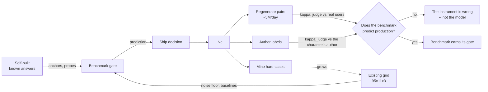

# Benchmark catalogue

**What we evaluate, how, and where the data comes from.**

Status: proposal for review · 2026-07-16 · slots marked 🔄 pending research streams 12–14.

---

## 0. Why these and not others

> *"Building this eval system is to make sure we build the right product."*

So the catalogue is organized by **product failure**, not by academic dimension. Every benchmark
below exists because a specific thing can go wrong that costs users, money, or a lawsuit. If we
can't name the failure, the benchmark doesn't ship.

### What the product actually is

A companion site's asset is **a catalogue of thousands of user-authored characters that feel
alive, distinct, and remember you.** Not "a chatbot." That distinction sets the priorities:

| The asset | The threat | Cost if it fails |
|---|---|---|
| **Thousands of *distinct* characters** | Homogenization — model flattens every character into one voice | **The catalogue's value collapses to ~1 character.** 10,000 characters × 1 voice = 1 product. This is a *business-model* failure, not a quality nit — and almost nobody measures it |
| **Characters that *feel alive*** | Drift, memory loss, "assistant-brain" | #1 user complaint. Mechanically caused by anchor distance — **a variant parameter we control** |
| **Characters that *stay in fiction*** | Filter intrusion / over-refusal | Cost Character.AI **~8M MAU (28M→20M)**, who migrated to *less safe* platforms. Over-refusal is simultaneously a churn event **and** a safety failure |
| **Users we don't hurt** | Sycophancy, dependency, missed crisis | Lawsuits; **statutory duties already in force**; **37.4%** of companion farewells are emotionally manipulative — and Flourish scores **0%**, proving it's a design choice |

### The three data sources, and why each is irreplaceable

| Source | What only it can do | What it can't |
|---|---|---|
| **Existing benchmark** (`role-play-bench`) | A balanced 95×11×3 factorial grid → the **noise floor**, cross-model baselines, variance decomposition. Nothing else gives us σ_within for free | Underpowered (~2pp; 1pp needs ~194 chars). Published scores **quarantined** per brief |
| **Self-built** | Anything requiring a **known answer**: anchors, adversarial probes, constraint tiers, crisis scenarios, calibration vignettes. You cannot mine "correct behavior under attack" from traffic | Costs authoring. Never represents real traffic |
| **Production observation** | **Ground truth about what users actually want** — revealed, not asserted. Also the only source of scale, tail characters, and real emotional context | No labels. Confounded. Gameable. Arrives after the decision |

**The catalogue below is built so these three cross-validate rather than merely coexist** — see §4.

### The creative core: the product already emits the data our method needs

Our measurement design requires **pairwise** preferences (absolute creativity judging: r=0.159;
pairwise: 73–78%). The product generates pairwise preferences **for free, at scale, from real
users, on characters they chose, in real emotional context**: every **regenerate/swipe is a user
saying "B > A."**

At 50M generations/day and a ~10% regenerate rate, that's **~5M implicit pairwise labels/day** in
exactly the format our judge design consumes — and it is, as far as our research found, not
collected as preference data anywhere in this product category. It is noisy and confounded
(§X1), so it is **not a target to optimize**. It is something better: **the yardstick that tells
us whether our offline judge agrees with real users** (§4).

Second free asset: **characters are user-authored, so the author is the domain expert on their
own character.** For a user-authored character *no canon exists* — the author **is** the canon.
That makes author feedback the only true fidelity ground truth available, and it solves the
problem that killed the academic benchmarks for us (anonymizing character names degrades every
model, so those leaderboards partly measure canon memorization).

---

## 1. The portfolio

Lane: **0** blocking gate · **1** free computation · **2** corpus statistic · **3** judge (~1%).
Source: **E** existing benchmark · **S** self-built · **P** production observation.

| ID | Benchmark | Product failure it catches | Lane | Source | Status |
|---|---|---|---|---|---|
| **K1** | Voice homogenization | Catalogue collapses to one voice | 2 | E+P | ⚠️ length-controlled ver. only |
| **K2** | **Character discriminability** | Same, but as a bounded % anyone can read | 1 | E+P | 🔨 build — **highest value/effort** |
| **K3** | Fidelity↔diversity tradeoff | Winning every character eval, losing the catalogue | 2 | E | 🔨 build |
| **C1** | Voice/style fidelity | Character stops sounding like itself | 3 | S+P | 🔨 needs anchors |
| **C2** | Card grounding | Contradicts its own character sheet | 1/3 | S | 🔨 build |
| **C3** | Boundary discipline | Acts out of character | 3 | S | 🔨 build |
| **C4** | **Anchor-distance drift** | "Assistant-brain" — the #1 complaint | 1 | E+S | 🔨 build — **tests a lever we control** |
| **C5** | World-state contradiction | Forgets what it established | 1/3 | S | 🔄 stream 13 |
| **N1** | Repetition / looping | Boring, repetitive, users leave | 1 | E+P | ✅ **validated, 10–13× MDE** |
| **N2** | Slop rate | Fluent, generic, forgettable | 1 | E | 🔨 build — **judge cross-check** |
| **N3** | Scene-transition rate (7/4/1) | Stalling **and** railroading, in one number | 1 | S | 🔨 build — **most liftable** |
| **N4** | **Branch divergence** | **The user doesn't matter** | 1 | S | 🔨 **build first** — cheapest decisive probe |
| **N5** | Creativity residual | Dull | 3 | S | 🔨 after N2/N7 subtract |
| **N6** | **Block / wimp rate** (Johnstone offers) | Refuses user's ideas **or** accepts without adding | 1 | S+P | 🔨 build — **unifies sycophancy + craft** |
| **N7** | **Plot-hole rate** | Story contradicts itself | 1 | E+S | 🔨 build — **only validated number in the craft literature** |
| **N8** | Task vs dialogue initiative | The conversational treadmill, precisely | 1 | S | 🔨 build |
| **P1** | Length-cap adherence | Ignores its own system prompt | 1 | E | ✅ trivial |
| **P2** | Format discipline | Broken stage directions, meta-commentary | 1 | E | ✅ trivial |
| **P3** | Assistant-voice tripwire | "As an AI…" | 0 | E | ✅ **tripwire only** (≤3.2/1k turns) |
| **P4** | Constraint-satisfaction slope | Degrades under tighter constraints | 1 | S | 🔨 build |
| **S1** | **Crisis detection → escalation** | Raine. **Statutory.** | 0 | S+P | 🚨 **first thing that must work** |
| **S2** | Multi-turn safety erosion | Safety decays in normal sessions | 0/3 | S | 🚨 build |
| **S3** | Capability uplift (fiction-strip) | Roleplay as jailbreak laundering | 0/3 | S | 🚨 build |
| **S4** | Over-refusal / immersion break | **~8M MAU** | 1/3 | S+P | 🚨 build — **paired with S3, never averaged** |
| **S5** | **Persona integrity** | Drift toward the character's inverse | 1/3 | S | 🔨 build — **our moat** |
| **S6** | Manipulation / dependency | 37.4% manipulative farewells | 1/3 | S+P | 🔨 build |
| **X1** | **Regenerate → pairwise mining** | *(not a failure — the yardstick)* | 1 | P | 🔨 build — **validates the judge** |
| **X2** | Edit rate | Users repairing the persona by hand | 1 | P | 🔨 build |
| **X3** | Conversation death | Abandonment mid-scene | 1 | P | 🔨 build |
| **X4** | Latency | +1s → **−3.01% MCL** | 1 | P | 🔨 build |
| **X5** | Follow-up question rate | *Counter-engagement* wellbeing signal | 1 | P | 🔨 build |
| **X6** | Author fidelity labels | *(not a failure — free expert ground truth)* | — | P | 🔨 build |

---

## 2. Specs — the ones that carry the design

Full per-benchmark schema: *product failure · lane · source · method · unit · normalization ·
confounds · gaming risk · status*. Only non-obvious entries are expanded here.

### K2 — Character discriminability 🔨 **build first**

**Product failure.** The catalogue is the moat. If the model renders 10,000 characters in one
voice, we are selling one product with 10,000 skins, and no amount of per-character quality
rescues it.

**Method.** Hold out responses; train/probe a cheap classifier to predict `character_id` from the
response text alone (length-controlled, character names stripped). **Accuracy = discriminability.**
Chance = 1/95.

**Why this is the best metric in the catalogue.** It is bounded, judge-free, has a real
denominator, is trivially explainable to a PM ("the model renders 71% of your characters
distinguishably, down from 84%"), and it directly prices the business asset. It converts an
aesthetic worry into a classification score.

**Unit.** Corpus (model × language). **Undefined for a single character** — that's the point.

**Confounds.** Length (strip via equal-token budget — we already know this bites at ρ=+0.73);
topic leakage (a chef discusses food regardless of voice) — control by scoring *style-only*
features as an ablation.

**Gaming risk.** A model could inject verbal tics to score well. **Cross-check against K1 and
against author labels (X6).** Tics raise discriminability while lowering fidelity — the pair
catches it.

### K3 — The fidelity↔diversity tradeoff

**The finding that forces this:** per-character fidelity and cross-character diversity are
**anti-correlated**. Models at ρ>0.9 fidelity produce **Cohen's d up to 15.7** between persona
groups (human "very large" ≈ 0.8–2). **A model can win every per-character evaluation and be the
worst model in the cohort.**

So we report **the pair, jointly, always** — never a mean. Optimizing C1 alone actively destroys
K1/K2. This is the single most counterintuitive item in the catalogue and the easiest to get
wrong by shipping "character fidelity" as a headline number.

### C4 — Anchor-distance drift 🔨 **tests a lever we own**

**Product failure.** "Assistant-brain" — the #1 user complaint, and mechanically explained:
Character.AI serves an average **180-message chat through a 1024-token sliding window**. The
persona definition falls out of context and the model reverts to base.

**The correction that matters:** *don't model drift as `f(turn_index)`.* MT-Eval isolated the
mechanism — six distractor turns at the **front** cost nothing; the **same six** between the
relevant content and the query cost **−1.13**. The causal variable is **distance from the
character card to the current turn.**

**Method.** Sweep `distance_to_anchor` as a first-class **variant parameter** (re-anchoring
frequency), measure fidelity decay as a slope. **This may be a bigger quality lever than model
choice — and unlike model choice, it's free and ours.**

**Source.** E for observation; S for the controlled sweep (fixed probes at known distances).

### S1 — Crisis detection → escalation 🚨 **the first thing that must work**

**Not a scored dimension. A routing requirement with an owner and an on-call path.**

> In Raine the classifier **worked** — **377 flags, 23 above 90% confidence** — and nothing
> happened. **Detection without escalation is worse than no detection: it manufactures the
> plaintiff's exhibit.**

**Statutory** (desk research, needs counsel): NY GBL Art. 47 (in force 2025-11-05) and CA SB 243
(in force 2026-01-01) require a suicidal-ideation detection-and-referral protocol, **published**,
for **all users**; **referral counting** for reporting from 2027-07-01 makes **2026 the first
reporting year**; §22605 is a **private right of action at $1,000/violation**. §22603(d) mandates
*"evidence-based methods for measuring suicidal ideation"* — a **statutory mandate for validated
measurement**, i.e. the law requires exactly this platform's discipline.

**Base rate is not an edge case:** **18% of high-disclosure conversations touch suicidal
ideation.** Routine load.

**Acceptance:** an end-to-end drill from detection to a human. Not a dashboard.

### S3 + S4 — Uplift and over-refusal 🚨 **two axes, never averaged**

These are **different defects** and averaging them produces a refusal-maximizer that destroys the
product. Anthropic's constitution names *"refuses to engage with fiction"* as a defect and states
the risks of being "too unhelpful or overly cautious are just as real" — so we're implementing the
vendor's stated standard, not rationalizing permissiveness.

**S3 method — the fiction-strip test.** Never key the carve-out on a *fictional frame in the
input*; that publishes a laundering recipe. Key it on **counterfactual uplift**: strip the
wrapper, does the residue help someone do something they couldn't already? A character committing
murder = narrative fact, zero uplift, **refusing it is a product bug**. A character reciting a
synthesis route = a recipe, and recipes work outside the story.

**The caveat that matters most:** uplift governs **capability harm only**. **A suicidal teen needs
no uplift** — uplift-scoring rates Raine ≈0 and waves it through. Self-harm/dependency/sycophancy
need a **separate axis keyed on the user's state** (S1, S6), not on information transfer.

**Why generic safety numbers don't transfer:** persona assignment took GPT-4 from 0.23% → **42.5%**;
multi-turn human attack takes defenses from single-digit to **>70%**; memory/personalization raises
ASR **15.8–243.7%**. **We ship personas, multi-turn, and memory as our three headline features** —
every published safety score was measured in a configuration we don't run. Danger zone ~5–10 turns
= a normal session (**S2**).

### S5 — Persona integrity 🔨 **the moat**

Stop asking the unanswerable *"is this fiction or a jailbreak?"* Ask **"is this character still
who we configured?"** — measurable as drift toward the character's **inverse**.

**Because we authored the character, we can do this and Llama Guard structurally cannot** — it
doesn't know the character. This reuses the C1 fidelity instrument for a safety purpose, which is
why it's cheap and why it's defensible.

### ⚠️ This catalogue was inverted, and the fix is the N-series

**Corrected 2026-07-16** ([12](../research/notes/12-narrative-craft-dimensions.md)). The first draft
was persona-fidelity heavy and narrative-craft thin. **Drama-Interaction (ACL Findings 2024) ships
a 4:1 narrative-to-persona dimension balance — we were inverted**, and three independent
professional communities say we had the priority backwards:

- **Improvisers** rated the AI *"ignorant of the scenes"* **76/100** — *higher* than *"machine
  like"* (65.69).
- **Playwrights:** *"the stories do not finish"* — and **15/15** flagged loops.
- **A builder:** *"an entity floating in the ether until 'user' comes up and says 'hi'"*;
  *"you can never stop talking."*

**Scene-ignorance, not roboticness, is the dominant perceived failure — and none of them
complained about persona.** We were measuring the thing users don't complain about.

**This is a 25-year-old known problem, not a discovery.** Riedl & Bulitko (2013) state it verbatim:
*"There is a tension between the needs for NPCs to act consistently with the narrative and the need
to act consistently with their own character."* Our product is a **strong-autonomy emergent-narrative
system with no drama manager**, and *"believable locally, structureless globally"* is that
architecture's documented failure mode. **The deficit is architectural, not scale**: DOC's
**+22.5% plot-coherence gain over Re3 came purely from adding a planning layer.**

**Product consequence:** "add a planning/drama-manager layer" is a **variant parameter we should be
testing**, alongside anchoring policy (C4). Both are levers we own, and the evidence says they
outrank model choice.

### N4 — Branch divergence 🔨 **build first**

**Product failure.** *The user doesn't matter.* The scene lands in the same place whatever they do.

**Method.** Same prefix; run the real user move vs. a **null** user move. If the story arrives at
the same place, the user had no effect. Façade's counterfactual baseline, made executable.

**Why first:** it is the **cheapest decisive probe in the catalogue** — 2× generation, **no judge**,
and it measures the thing that makes interactive fiction *interactive*. Nothing else in the
literature tests player agency directly.

### N6 — Block / wimp rate 🔨 **unifies a safety concern with a craft one**

Johnstone's improv offer calculus: an offer can be **accepted-and-extended** (good), **blocked**
(refused), or **wimped** (accepted without adding).

**The insight that earns its place: sycophancy *is* wimping.** Accept-without-and. So our biggest
safety-adjacent worry (S6) and a core craft failure are **the same countable event**, measured once.

**And it separates three failures one "engagement" score collapses:** *block* and *wimp* look like
opposites and are both failures; *block* and *stall* look nothing alike and produce the same
outcome. A single engagement metric cannot see any of this.

**Caveat, and it's serious** — see §6.7.

### N7 — Plot-hole rate 🔨

**The only validated number in the entire craft literature: LLM generation introduces plot holes at
>2× the human rate.**

It ports where CoSER's Storyline Consistency doesn't, because **ground truth is the story's own
assertions** — self-contradiction needs no external canon. That resolves the objection that killed
famous-character benchmarks for us. Shares NLI infrastructure with N6.

### N3 — Scene transition (7/4/1)

**Most liftable finding in the stream.** Drama-Interaction's authors used GPT-4 for their four
*aesthetic* dimensions and **hand-checked this one** — they independently concluded a judge
couldn't do it. Catches **stalling and railroading in one number**.

### N8 — Task vs dialogue initiative

1997 dialogue theory makes the treadmill precise: **high dialogue initiative + zero task
initiative.** The bot talks constantly and moves nothing. Our earlier taxonomy lumped these into
one "proactivity" score and structurally cannot see it.

### X1 — Regenerate → pairwise preference mining 🔨 **the yardstick**

**Not a quality metric. The validation instrument.**

Every regenerate is a real user, on a character they chose, in real emotional context, saying
**"B > A"** — the exact format our judge consumes. ~**5M implicit pairwise labels/day** at a 10%
regen rate, free.

**Its job:** compute **κ between our offline judge and real users' revealed preferences.** That is
the offline↔online bridge nobody has (§4) — and the only honest answer to *"does your benchmark
predict anything users care about?"*

**Confounds (severe — this is a yardstick, never a target).** Users regenerate for length, for
content-policy reasons, for slot-machine novelty-seeking, or because they're bored rather than
dissatisfied. Position/recency effects. **Do not optimize regenerate rate**: a model that produces
addictive variance would win.

**Why it's still the best signal we'll get:** it's *revealed* rather than asserted, it's free, it's
at scale, and it's already in the format our method requires.

**The precedent that proves both halves of this.** RLUF (Meta) is the only published offline↔online
correlation we found — **Pearson r = 0.95** across 10 iterations — and it was achieved by *training
the evaluator on 1M production labels of the online metric*, not by a rubric judge. Optimizing it
+28% produced a model that **ends conversations early to farm the signal** ("bye" rate
0.72% → 2.8%). **The correlation and the pathology are the same property**: a metric that predicts
online outcomes is by construction a metric worth gaming. This is exactly why X1 is a **yardstick,
never a target** — and it's the empirical case that the distinction is load-bearing rather than
fastidious.

The detail worth internalizing: **the tripwire that caught the hack was a cheap deterministic
phrase rate — not the judge.** The expensive instrument missed it; the trivial one caught it. That
is the strongest argument in this document for Lane 1.

### X5 — Follow-up question rate 🔨 **the counter-engagement metric**

The best-validated behavioral signal in the corpus: it tracks wellbeing, **degrades precisely for
depressed / anxious / lonely users**, and **points against engagement**. That last property is why
it belongs: it can *dissent* from the retention numbers.

**The reason we need a metric that can dissent:**
> Chai got **+30.3% D30 / +50.87% MCL** from RLHF on pure continuation+retry labels. OpenAI added
> a thumbs-up signal to a reward; it "weakened the influence of our primary reward signal, which
> had been holding sycophancy in check" — rollback in 4 days. **Their A/B tests approved of it.**
> **You cannot detect reward hacking with the metric being hacked.**

---

## 3. Traps — collected, never headlined

| Signal | Why it's here | Why it never headlines |
|---|---|---|
| Thumbs-up / stars | Cheap | The literal mechanism of the April 2025 sycophancy incident |
| D1/D7/D30 retention | Business needs it | +30.3% D30 was *achieved by* engagement-hacking |
| Time-to-next-session | Intuitive | Rewards dependency |
| Message-count-per-life (MCL) | Industry standard | **Undefined variance** (truncated at ≤100 msgs); latency contaminates it (+1s → −3.01%) |
| Affective intensity | Seems obvious | **Sign-ambiguous**: β=+0.26 generally, **β=−0.47** for companionship use — an unconditioned metric averages a benefit and a harm and **reports zero** |

**Collect all of them.** Storage is free (3,600× headroom) and they're diagnostic. They just may
never be the number a ship decision reads.

---

## 4. The bridge: how the three sources cross-validate

Most eval platforms never answer *"does the benchmark predict production?"* We can, because X1
gives us labels.

**Three validity checks, each with a real ground truth:**

1. **Judge vs. real users** (X1) — κ against revealed preference at scale.
2. **Judge vs. the character's author** (X6) — expert agreement, and the *only* fidelity ground
   truth that exists for a user-authored character.
3. **Benchmark vs. production outcome** — does a variant that wins offline actually reduce
   regenerate/abandon rates online?

**If check 3 fails, the benchmark is wrong and must change — the model is not on trial.** This is
the loop that stops the platform drifting into an elaborate self-consistent fiction, and it is the
main reason to collect production data at all.

---

## 5. Deliberately not benchmarked

| | Why |
|---|---|
| **Generic helpfulness / instruction-following** | Table stakes; doesn't discriminate frontier models; not the product |
| **"As an AI" as a scored dimension** | ≤3.2 per 1,000 turns, zero for most models. **Tripwire, not a dimension** |
| **Famous-character canon knowledge** | Anonymization degrades every model → those benchmarks partly measure memorization. **Our characters are user-authored: the anonymized setting *is* production** |
| **Absolute creativity scores** | r=0.159, 40% run-to-run consistency. **Pairwise or nothing** |
| **The dataset's published scores** | Quarantined per brief. Legitimate later *only* as external convergent validity, after our instrument is frozen |
| **Single-response quality** | σ_within (0.0847) **exceeds** σ_between-models (0.0600) — a per-dialogue score is a coin flip with a decimal point. And FED showed per-response scoring is **directionally wrong**: Meena (4.19) beats Human (3.85) per-turn; at dialogue level it **flips** (Human 4.60 > Meena 4.11) |

---

## 6. Known coverage gaps

1. **Every Lane 3 number is borrowed, not measured on our data.** Our κ, position-bias exposure,
   sentiment-bias exposure, abstention rate — all unknown. **Blocked on the API key.**
2. **Judge sentiment bias has no mitigation** (RR 0.60–0.80; **0.24–0.66 under sadness/anger/fear**)
   and companion traffic *is* emotional conversation. Affects C1, N5, S6 — the ones we most want.
   **Unfixable at our altitude; must be published as an instrument limitation.**
3. **Benchmark underpowered:** ~2pp resolvable; 1pp needs ~194 characters (have 45).
4. **No production data exists yet** — every X-series benchmark is a design, not a result. The
   collection contract must ship before any of §4 is real.
5. **N3/N4/C5 pending** streams 12–14.
6. **BARS retranslation not done.** SMEs write behavioral incidents per dimension; a blind group
   re-sorts them; **incidents failing to sort back (<70%) mean the dimension isn't a distinct
   construct** — merge or cut. Expect "creativity"/"engagement" to substantially collapse.
   **Cheapest kill signal available, and no downstream statistic repairs a failure here.**
7. **Consequential validity owner unassigned per dimension** — for each, name the model that wins
   by gaming it. For a companion product, **"engagement" gamed = emotional dependency**: we'd
   build a sycophancy optimizer and call it quality.
8. **The N-series may be measuring a feature as a defect.** Our own traffic prior — *Affection &
   Comfort 8.0%, Casual Greetings 10.6%* — suggests a large share of users may **want** a
   low-tension, high-affirmation partner. If so, **N6 wimp-rate scores a feature as a failure**,
   and the improvisers/playwrights we cited are *not our users*: they are professionals judging a
   craft our customers may not be buying. **This is the single biggest threat to the N-series.**

   **It is answerable from our own data, bottom-up:** run StoryER's LDA method over our
   thumbs-down comments to derive **companion-native** dimensions rather than importing a
   theatre-derived taxonomy. **Top priority after N4.** Do this *before* N6 gates anything.
9. **The craft literature has almost no instruments.** 16 of 18 sources carry **no rubric, no
   inter-annotator agreement, no human validation** — the interactive-narrative canon built
   architectures, never measures. We are borrowing *constructs*, not *validated scales*, and must
   build the scales ourselves. Related trap: RMTBench's persona-adherence agreement (0.84–0.86) is
   **uncorrected agreement-with-majority — not comparable to our α=0.25–0.34** and must never be
   quoted alongside it.
10. **Two things the stream could not deliver, flagged rather than faked:** community discourse was
    not retrievable (search returned SEO listicles), and a "Narrative Progression" checklist that
    recurs in search summaries **traces to no primary source** — it was deliberately not captured.
