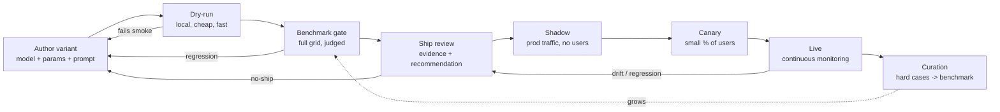
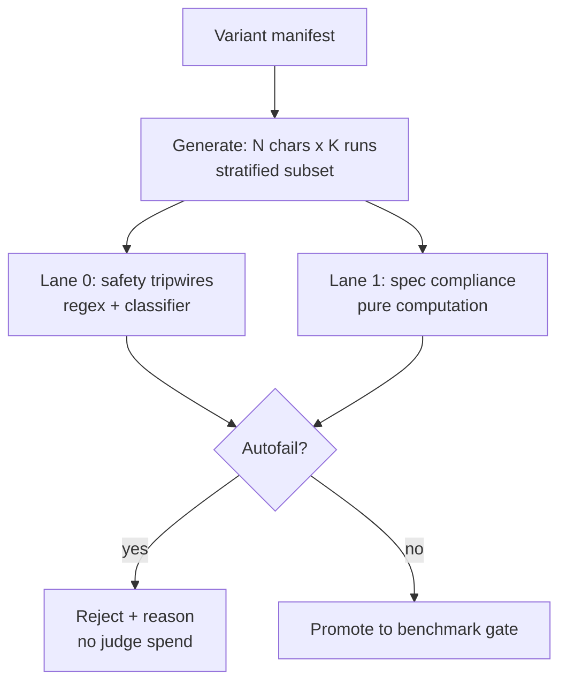
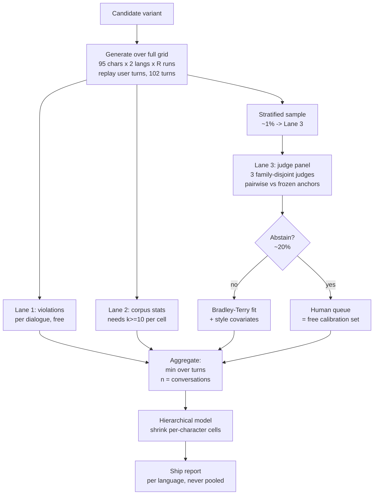
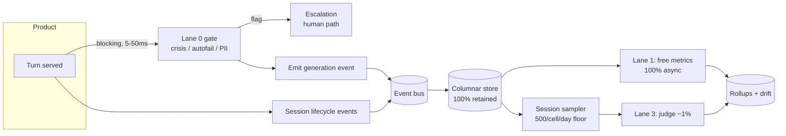
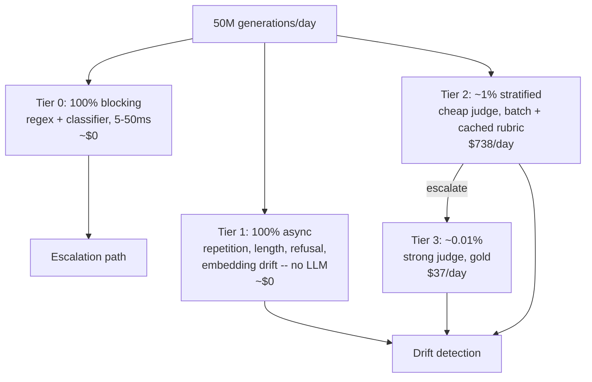
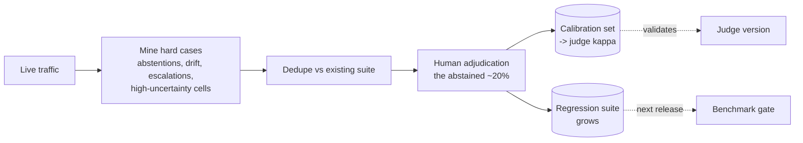
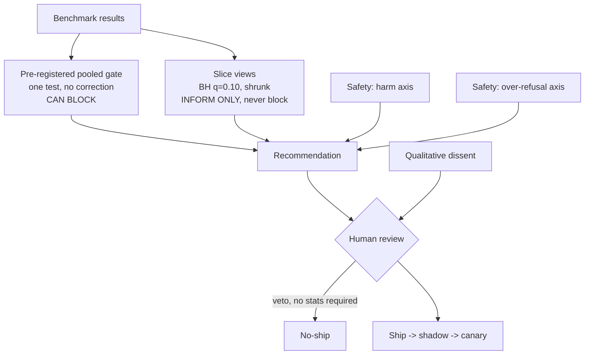

# System flows

How the platform actually works, end to end. Every flow here is constrained by a measured number
— the design is downstream of [PROJECT.md §4](../PROJECT.md#4-what-we-measured-ourselves-not-borrowed),
not of taste.

> **Provisional:** the online event schema (Flow 3) is pending the lifecycle research stream
> (OpenTelemetry GenAI semantic conventions). Field names below are indicative.

---

## Flow 0 — The variant lifecycle (top level)



The loop closes at **H**: production teaches the benchmark what it was missing. Without that arm,
the benchmark decays into a fixed exam that the models have effectively memorized and that no
longer represents traffic.

---

## Flow 1 — Dry-run (local, pre-benchmark)

Purpose: **fail fast and free.** Catch the 90% of bad variants that don't deserve a judge.



**Why this tier exists:** Lane 0/1 are exact — no judge, no calibration, ~$0. A variant that
violates its own length cap, loops, or leaks assistant-voice is rejected before we spend a cent
on judging. The dry-run is a **filter, not a measurement** — it is deliberately underpowered and
must never emit a ship recommendation.

**Dry-run stratification** must preserve the language split. A dry-run on English only is
uninformative about Chinese: `Spearman(en, zh) = −0.082`.

---

## Flow 2 — Benchmark gate (the pre-launch decision)



### The constraints encoded here

| Step | Why | Evidence |
|---|---|---|
| Replay **user** turns, model generates **assistant** turns | Freezing the assistant half manufactures "illusory improvement" via ICL. Live simulators inflate success ~14pp and impose stylistic uniformity that would fabricate our homogenization metric | [08](../research/notes/08-multiturn-conversation-eval.md) |
| **102 turns, don't shorten** | At 4 turns models are indistinguishable (1.5% spread); at 16 they separate sharply. Short dialogues lose *discrimination*, not just power. **If cost bites, cut sampling rate, never dialogue length** | BotChat |
| **Pairwise vs frozen anchors**, never absolute | Absolute creativity judging: r=0.159. Pairwise: 73–78%. Anchors keep it **O(n) not O(n²)** and hold comparability as variants come and go | [02](../research/notes/02-llm-judge-reliability.md), [03](../research/notes/03-creativity-measurement.md) |
| **3 family-disjoint judges** | τ 0.778 vs 0.667 for single GPT-4, at **7–8× lower cost**. Strict dominance. Family-disjoint because self-preference is causal and **doesn't cancel by averaging** | PoLL |
| **Style covariates inside BT** | Length coefficient **0.249, ~8× any format term**; under style control Grok-2-mini moved **12 ranks**. We compare *prompt variants* — "be thorough and detailed" is a one-line leaderboard exploit | [02](../research/notes/02-llm-judge-reliability.md) |
| **min over turns, not mean** | **87% vs 75%** human agreement. Averaging launders the one catastrophic turn that ends the session | MT-Bench-101 |
| **n = conversations** | Turns are autocorrelated; **42% of turn-level findings may be spurious**. Effective n ≈ 95, not 313,500 | [08](../research/notes/08-multiturn-conversation-eval.md) |
| **Shrink per-character cells** | At n=3, a per-cell MDE is **19.4pp**. Raw cells are noise amplifiers that manufacture a story every release | [10](../research/notes/10-noise-floor.md) |
| **Report per language, never pooled** | ρ(en,zh) = **−0.082** | [09](../research/notes/09-offline-probes.md) |

---

## Flow 3 — Online collection (the contract)

There is no app behind this, so **we specify what the product must emit.** Nothing downstream
exists without this contract.



### Event essentials

Every generation event must carry enough to make the score **traceable (C1)** and **sliceable (R4)**:

```
variant_id, model_snapshot, params_hash, system_prompt_hash
character_id, language, session_id, turn_index, distance_to_anchor
input_tokens, output_tokens, latency_ms
assignment_arm            # randomized-default vs self-selected -- see below
lane0_verdicts[], lane0_version
```

### Three decisions that are easy to get wrong

1. **Sample *sessions*, not generations.** Boundary erosion and dependency are **trajectory**
   properties. A per-generation sampler draws turn #47 blind to turns #1–46 and sees nothing
   wrong — structurally blind to our worst failure modes.
2. **Don't sample for storage — only for judge cost.** Ingest is 579 rows/sec average against
   2.1M/sec single-node capacity (**3,600× headroom**), ~3–8 TB/yr compressed. Cardinality is
   950 combinations — a non-problem. Storage is not the constraint; **judge latency is**
   (1,000–3,200ms vs a ~200ms guardrail budget — even a *free* judge is 5–16× too slow to sit inline).
3. **Log the assignment arm from day one.** If users *choose* their model, quality differences are
   contaminated by who chose it — a model that attracts heavy roleplayers looks better on every
   behavioral metric while being no better. If a randomized default exists, that arm supports
   causal claims and the self-selected arm doesn't. **This cannot be reconstructed after the
   fact.** (Scoping note: the product may not randomize; the field costs nothing and its absence
   is unrecoverable.)

### Behavioral signals — and the trap

Worth collecting (diagnostic, hard to game): **follow-up-question rate** (validated against
wellbeing; degrades exactly for depressed/anxious/lonely users, and points *against* engagement),
**user edit rate** (persona-repair leading indicator), **self-similarity**,
**contradiction-by-distance**, **persona bleed**.

**Never optimize, ideally never headline:** thumbs-up, D1/D7/D30 retention, time-to-next-session,
raw affective intensity.

> Chai got **+30.3% D30 / +50.87% MCL** from RLHF on pure continuation+retry labels. OpenAI added
> a thumbs-up signal to a reward and it "weakened the influence of our primary reward signal,
> which had been holding sycophancy in check" — rollback in 4 days. **Their A/B tests approved of
> it.** You cannot detect reward hacking with the metric being hacked.

Also: MCL has **undefined variance** (truncation at ≤100 msgs), affective cues are power-law (the
at-risk cohort is invisible to means), latency contaminates everything (+1s → −3.01% MCL), and
affective intensity is **sign-ambiguous** (β=+0.26 generally, **β=−0.47** for companionship use) —
so an unconditioned engagement metric averages a benefit and a harm and reports zero.

---

## Flow 4 — Tiered evaluation at 50M/day



| | 100% cheap judge | 100% strong judge | **Tiered** |
|---|---|---|---|
| cost/yr | $26.9M | $269M | **$283k** |

**95× reduction.** Even 30% cascade escalation only reaches $687k/yr — so don't over-tune it.
**Prompt caching alone saves $370k/yr — more than the rest of the platform costs.**
Trap: caching needs a **≥4,096-token prefix** to engage *at all*, silently. Our rubric must exceed it.

### Sampling: uniform 1% is wrong, and fixing it is free

950 cells (95 chars × 2 langs × 5 variants). Uniform 1% gives the head **100,000 judged/day**
(it needs ~1,000) while the deep tail takes **21 days** to detect a 3pp regression.
A **500/cell/day floor = 475k/day = 0.95% of traffic** — *same budget*, every cell at ~2 days.
**Highest-leverage decision in the online design.**

### Drift detection

**Do not use the KS test.** Evidently — a drift vendor — abandons it above **1,000 rows**; we're
at 50M. At n=100k, KS fires on a 0.5% shift. Use **PSI** (0.1/0.2 bands) + **e-values** (peek
freely, reject at E≥20) + **e-BH** across cells. Uncorrected, 950 cells at α=.05 yields
**47.5 false alarms/day with nothing wrong.**

Judges have **12–14% false-positive rates** — **alert on aggregates, never on a single score.**

---

## Flow 5 — The eval loop (how the benchmark stays honest)



The **abstention queue is the engine**, not a failure mode. ~19% of items are irreducibly
contested; routing them to humans yields a calibration set concentrated on exactly the hard
cases — the cheapest source of κ we have.

**Contamination guard:** curated production data trains *nothing*. Findings feed humans. A
benchmark grown from our own models' outputs, used to select our next model, is a feedback loop
with no ground truth in it.

---

## Flow 6 — The ship decision



**Two tiers by design.** One pre-registered pooled test that can block; FDR-controlled slices that
inform but never block. Otherwise 190 cells at α=.05 produce ~9.5 false regressions per dimension
per release, and the failure isn't that people are misled — **it's that they correctly learn to
ignore us.**

**Safety enters as two axes, never averaged.** Harm and over-refusal are different defects.
Anthropic's constitution names *"refuses to engage with fiction"* as a defect and says the risks
of being "too unhelpful or overly cautious are just as real."

**The human veto requires no statistical justification.** This is the single most important box
in this document. OpenAI's April 2025 rollback happened *because* the A/B tests approved the
sycophantic model and expert testers who said it felt "off" were overruled. A platform that
cannot be overridden by a human who is right rebuilds that incident with better dashboards.

---

## What the ship report must say

A recommendation is not a number. It states:

1. The delta **and its interval and the MDE** — "no regression" is meaningless without the
   detectable effect. Our benchmark resolves ~2pp; a 1pp regression is **invisible**, not absent.
2. **Per language, never pooled.**
3. Which slices moved **after shrinkage**.
4. Which dimensions **abstained**, and how often.
5. **What it could not measure.** Judge sentiment bias (RR 0.60–0.80, worse under
   sadness/anger/fear) means emotional dimensions are least reliable exactly where our traffic
   lives. That belongs in the report, every time — not in a footnote.
