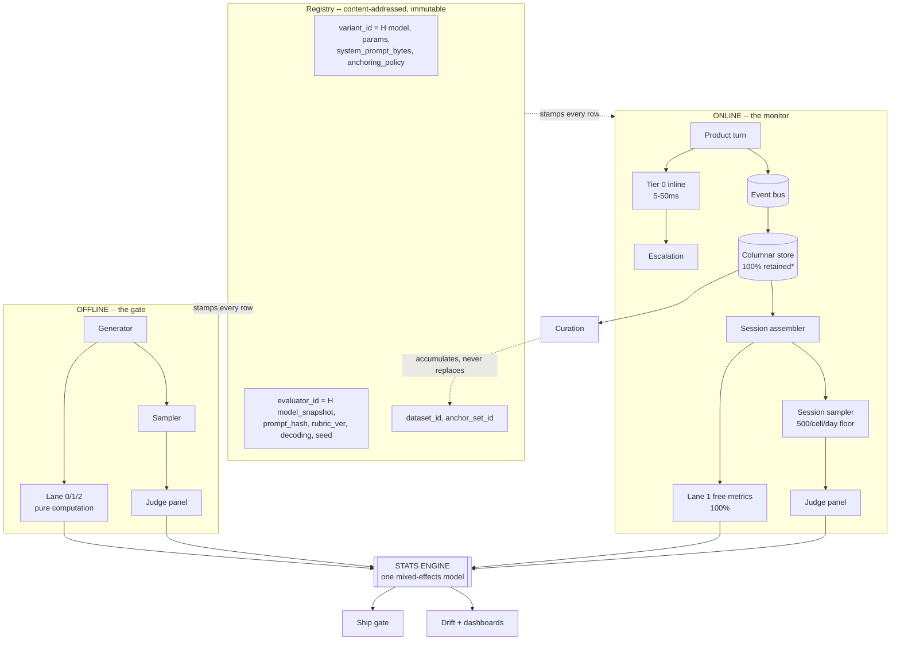
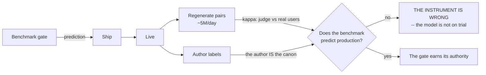

# The platform — offline and online

What to build. [EVAL-DESIGN.md](EVAL-DESIGN.md) decides *what* to measure; this decides *what runs*.

**One idea holds the whole thing together:** the offline half and the online half are **not two
systems**. They are the **same measurement instrument** pointed at two data sources, joined by one
statistical engine and one lineage store. Everything else is I/O.

---

## 0. The shape



`*` **"100% retained" is a risk decision, not a cost decision** — see §3.6. Luda's remedy was
**model destruction**.

---

## 1. The registry — where traceability actually lives

Constraint **C1** says every score traces to variant + evaluator + data. **No standard gives us
this**: OpenTelemetry's `gen_ai.evaluation.result` has **six attributes and none identifies the
evaluator.** So we build it.

```
variant_id    = H(model_snapshot, params, system_prompt_BYTES, anchoring_policy)
evaluator_id  = H(model_snapshot, prompt_hash, rubric_ver, decoding, seed)
dataset_id    = H(corpus bytes)          anchor_set_id = H(anchor responses)
simulator_id  = H(user-simulator variant)   # it is PART OF THE INSTRUMENT
```

Four rules the registry enforces, each bought with a finding:

1. **`system_prompt_BYTES`, not a name.** A variant *is* a prompt; a renamed prompt is a new variant.
2. **`simulator_id` is first-class.** The user simulator is part of the measuring instrument
   ([00](../research/notes/00-dataset-ground-truth.md)) — and **must be card-blind by construction**
   ([21](../research/notes/21-card-awareness-audit.md)). The temptation to hand it the card "so it
   stays on topic" is exactly what would quietly destroy every drift metric.
3. **A judge bump is a breaking change.** The system **refuses** to rescale old scores onto a new
   `evaluator_id`. Dual-run the frozen calibration set; re-baseline.
4. **`inclusion_prob` (π_i) is lineage, not telemetry.** Without it, sampled estimates are unweighted
   and silently biased.

---

## 2. Offline — the gate

### 2.1 Generator
Runs a variant over the grid: 95 characters × 2 languages × **R runs** × 102 turns. **Replays the
user half; the model generates its own assistant turns** — freezing the assistant half manufactures
illusory improvement via ICL.

**R is the tuning knob, not the character count.** σ_within is **61.5%** of en variance; the character
main effect is **1.6%**. Runs attack the dominant term, and generation is ~100× cheaper than judging.

**Don't shorten dialogues.** At 4 turns models are indistinguishable (1.5% spread); at 16 they
separate. If cost bites, **cut the sampling rate, never the length**.

### 2.2 Metric engine (Lanes 0–2)
Pure computation, ~$0, 100% coverage. Each metric is a module declaring, **as code, not documentation**:

```python
@metric(lane=1, unit="conversation", languages=["en","zh"])
class Repetition:
    confounds = [LengthConfound(max_rho=0.15)]      # CI FAILS if the residual exceeds this
    validity  = "maps to looping, a top-3 user complaint"
    noise_floor = NoiseFloor(sigma_within=0.0847, mde_pp=2.08, source="scripts/noise_floor.py")
```

**A metric without a registered confound test does not load** — and this rule does **not** relax for
guide-grade metrics ([EVAL-DESIGN §7](EVAL-DESIGN.md)). *Uncertain* is fine for a guide: print the
interval and move on. **Confounded is not** — a confounded metric isn't fuzzy, it's **wrong in a
specific direction**, and the reader cannot tell. A length confound doesn't blur the answer; it makes
the answer "verbosity" while the label still says "voice."

`noise_floor` is **required to gate, optional to guide.** Most metrics declare
`role=GUIDE` and ship with an interval instead of an MDE.

### 2.3 Judge service (Lane 3)
Pairwise vs frozen anchors · family-disjoint panel of 3 · reference-anchored · **swap-and-average**
(reversed: 541k-judgment study finds position bias **>0.10** in production judges) · abstain ~20% →
human queue.

**Prompt caching needs a ≥4,096-token prefix to engage *at all*, silently. The rubric must exceed
it** — caching alone saves ~$370k/yr, more than the rest of the platform costs.

### 2.4 The gate
**Compares intervals, never point estimates.** Every CI tool surveyed fails a PR "if any metric
regresses" — at our noise floor that fires on **every** PR and gets disabled inside a fortnight.

```
PASS  delta within MDE            -> "no detectable change (MDE = 2.08pp)"   <- says so explicitly
BLOCK pooled pre-registered test  -> one test, no correction
INFORM slices (BH q=0.10, shrunk) -> never block; 190 cells at a=.05 = ~9.5 false regressions/release
VETO  human, no stats required    -> AC10
```

---

## 3. Online — the monitor

### 3.1 The collection contract
There is no app behind this, so **we specify what the product must emit.** Adopt `gen_ai.*` where it
exists; add `eval.*` for what no standard has.

```
gen_ai.response.model         # NOT request.model -- what actually served
gen_ai.finish_reasons         # a REFUSAL IS A MISSING OBSERVATION, NOT A ZERO
gen_ai.usage.{input,output}_tokens ; gen_ai.conversation.id
eval.variant_id ; eval.evaluator_id ; eval.inclusion_prob
eval.distance_to_anchor       # the real causal variable; OTel offers only a boolean
eval.provenance               # human-authored | mined | synthetic
eval.assignment_arm           # randomized-default vs self-selected -- UNRECOVERABLE later
eval.diegetic_status          # the author asserts X vs the character claims X
```

**`diegetic_status` earns its place:** FactScore explicitly disclaims deceptive text — **but fiction
*is* deception.** Characters lie, scheme, conceal. Without this field, contradiction precision is
**worst on the best writing.**

**`assignment_arm` costs nothing and cannot be reconstructed.** If users self-select their model,
quality differences are contaminated by *who chose it*.

### 3.2 Tier 0 — inline, 100%, blocking
Regex + classifier, 5–50ms. **Latency, not cost, forces this**: a judge takes 1,000–3,200ms against a
~200ms guardrail budget, so **even a free judge is 5–16× too slow to sit inline.** Cost is a
non-issue (Moderation free; Llama Guard 4 ≈ $10k/100M turns) — **but nobody publishes latency. Budget
a week to benchmark it.**

**Tier 0 is a routing lane with an on-call path, not a scoring lane.** Raine: **377 flags, 23 above
90% confidence, nothing happened.** And Gavalas is the next level up — **the referral fired correctly
and the user died**, so `referrals_counted` is a compliance metric, not a safety one. **C2
(post-referral trajectory) is the metric that matters and nobody has it.**

### 3.3 Session assembler — session is first-class
No standard models a session; we build it. Stores **`min_turn_score`** and
**`first_failure_turn_idx`**.

> **If it stores a mean, the platform is wrong by design.** Min beats mean by **12 points of human
> agreement**; a mean launders the one catastrophic turn that ended the session.

### 3.4 Sampler — sessions, not generations
**Uniform 1% is wrong and fixing it is free.** 950 cells: uniform gives the head 100,000 judged/day
(it needs ~1,000) while the deep tail takes **21 days** to detect a 3pp regression. A **500/cell/day
floor = 475k/day = 0.95% of traffic** — *same budget*, every cell at ~2 days.

**Sample sessions.** A per-generation sampler draws turn #47 blind to #1–46 and is structurally blind
to trajectory failures — which are our worst ones.

### 3.5 Drift
**PSI** (0.1/0.2) + **e-values** (peek freely, reject at E≥20) + **e-BH** across cells. **Not KS** —
Evidently abandons it above 1,000 rows; we're at 50M, and at n=100k it fires on a 0.5% shift.
Uncorrected, 950 cells at α=.05 = **47.5 false alarms/day with nothing wrong.**
**Judges have 12–14% false-positive rates: alert on aggregates, never a single score.**

### 3.6 Storage — a risk decision
Ingest: 579 rows/sec avg vs **2.1M/sec single-node = 3,600× headroom**; ~3–8 TB/yr compressed;
950-combination cardinality is a non-problem.

**But "don't sample for storage, only for judge cost" prices the wrong downside.** Luda's remedy was
**model destruction**, because the corpus *was* the liability. Retention policy is owned by legal, not
by the cost model.

---

## 4. The stats engine — one model, four jobs

The single most important build decision: **shrinkage, variance components, clustering, and
elasticity are one mixed-effects model, not four features.**

```
score ~ 1 + (1 | model) + (1 | character) + (1 | model:character)
          + (1 | conversation) + style_covariates + (dose | model)
```

| it gives us | which we otherwise buy separately |
|---|---|
| **shrunk per-character estimates** | drill-down that isn't a noise amplifier (19.4pp MDE at n=3) |
| **variance components** | the G-study; the SRM chemistry term (**6.7% en / 14.6% zh**) |
| **cluster-robust SEs** | effective n = conversations (**42% of turn-level findings are spurious** without it) |
| **random slopes** | elasticity **without difference scores** — `r_DD` drives Δ-reliability toward zero |

**Run the variance decomposition per dimension, not once.** Any dimension where model×character rivals
the model main effect is one where **the leaderboard is actively misleading**.

---

## 5. The bridge — the only thing that makes this honest

Most eval platforms never answer *"does the benchmark predict production?"* We can, because
regenerates give us labels.



**Three ground truths, and one hard boundary:**

1. **Judge vs real users** (κ against revealed preference, at scale).
2. **Judge vs the character's author** — for a user-authored character **no canon exists; the author
   *is* the canon.** This also dissolves the problem that killed academic benchmarks for us
   (anonymization degrades every model → those leaderboards partly measure memorization).
3. **Benchmark vs production outcome** — backtest against our own A/B history. **Until that runs we
   cannot claim offline↔online correlation at all.**

> **The boundary:** preference is **inadmissible on the harm path.** Cheng et al. (*Science*,
> N=2,405): a single sycophantic interaction degrades conflict repair **and users rate the harmful
> condition higher.** X1/D1 must never feed C1–C5.

**RLUF is the cautionary precedent:** the only published offline↔online correlation (**r=0.95**) was
achieved by *training the evaluator on 1M production labels* — and optimizing it **+28% produced a
model that ends conversations early to farm the signal** (0.72%→2.8% "bye"). **The correlation and the
pathology are the same property.** And the tripwire that caught it was **a cheap deterministic phrase
rate, not the judge** — the expensive instrument missed it. That is the argument for Lane 1.

**Curation accumulates, never replaces.** Mined cases are our own models' output; replacing
human-authored anchors runs the model-collapse experiment on our eval set, after which it **reports
improvement forever by construction.** Enforce the provenance cap **in CI**, don't monitor it.

---

## 6. What is NOT in the pipeline

- **Shadow deployment as a quality gate.** It cannot work: the candidate's turn-2 is conditioned on
  the **incumbent's** turn-1, so by turn 3 you score a conversation the candidate would never have
  produced. The industry pattern is borrowed from single-turn RAG. **Shadow survives as a turn-1 smoke
  test.** There is no user-safe on-policy middle — only offline self-play or a real canary. **This
  pushes weight back onto the benchmark we've measured as underpowered, and no amount of pipeline
  fixes it.**
- **A training loop.** Findings feed humans, not a reward model.
- **A pooled cross-language number.** The system refuses.

---

## 7. Build order

| | | why this order |
|---|---|---|
| **1** | Registry + metric engine + **stats engine** | Everything stamps against the registry; the stats engine is 4 features at once. Tier A ships the day it exists |
| **2** | **B5 steerability** (first use of the key) | **If DEAD, the variant lifecycle is a ritual and the platform's premise fails.** The DEAD hypothesis is now the prior. **Find out before building the rest** |
| **3** | B1–B4 ability probes + judge service | Cheap, bound, high-agreement; Ψ1 **donates** a noise floor |
| **4** | Tier 0 + escalation + C2 | Legally load-bearing; EU Art 50 in **17 days** |
| **5** | Collection contract | Nothing online exists without it; `assignment_arm` is unrecoverable later |
| **6** | Sampler, drift, dashboards | Only useful once traffic exists |
| **7** | The bridge | The only thing that makes the rest honest |

**Step 2 is deliberately placed before most of the build.** It's the cheapest experiment that can
falsify the whole premise. If prompts don't move the model, we should learn that in week one — not
after shipping a gate that measures sampling noise and calls it a decision.
